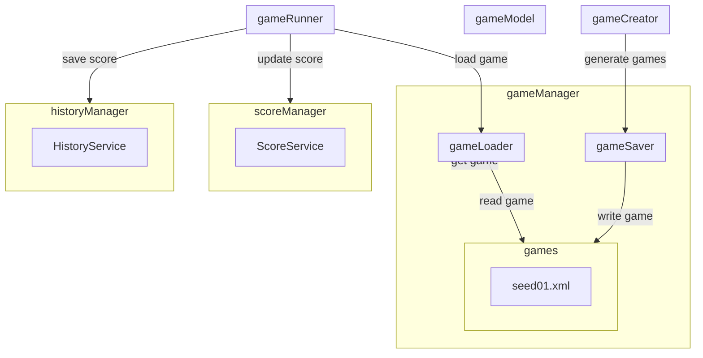

# DubbleLike

## Architecture

```mermaid 
flowchart

    subgraph gameCreator

    end

    subgraph gameModel

    end

    subgraph gameManager
        subgraph gameLoader

        end
        subgraph gameSaver

        end
        subgraph games
            seed01.xml
        end
    end

    subgraph gameRunner

    end

    subgraph scoreManager
       ScoreService
    end

    subgraph historyManager
        HistoryService
    end

    gameRunner -- update score --> scoreManager
    gameRunner -- save score --> historyManager
    gameCreator -- generate games --> gameSaver
    gameManager -- get game --> gameLoader
    gameLoader -- read game --> games
    gameSaver -- write game --> games
    gameRunner -- load game --> gameLoader
    
```